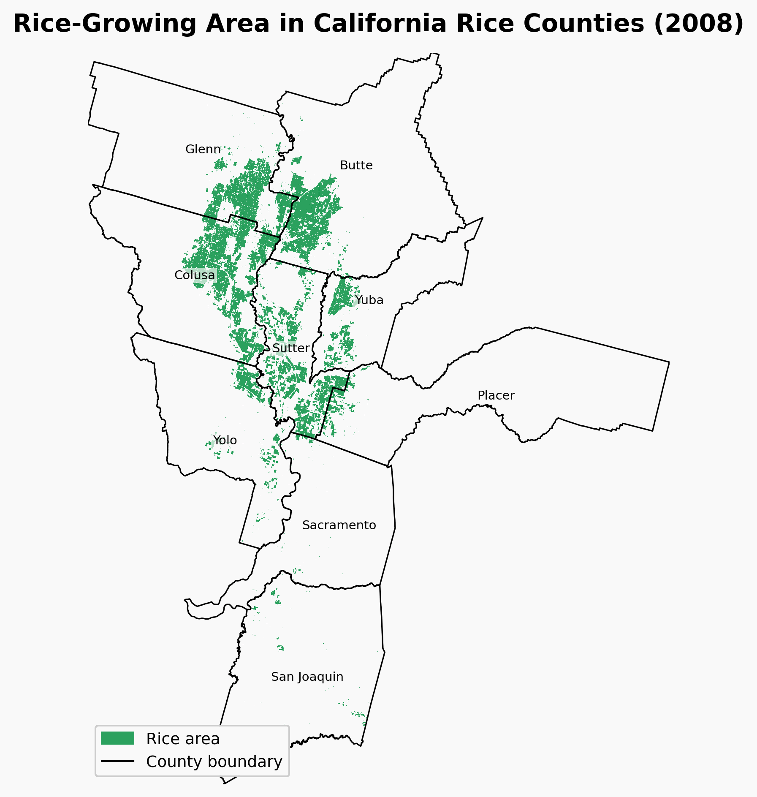

# California_Rice_ClimateChange
This project aims to build the statistical relationship between historical Temperature Indices calculated from gridMET and county-level rice yields in California via Lasso regression, and project future rice yield based on LOCAv2 climate dataset

# Research component include:
 - Growing degree day phenology modeling
- Stage-specific temperature stress indices
 - Lasso regression yield models
 - climate projections using lOCA2 Hybrid CIMIP6 datasets

# Study Region
Nine rice growing counties in the Sacramento Valley, California

# Status: 
Work in progress as part of my MS thesis

